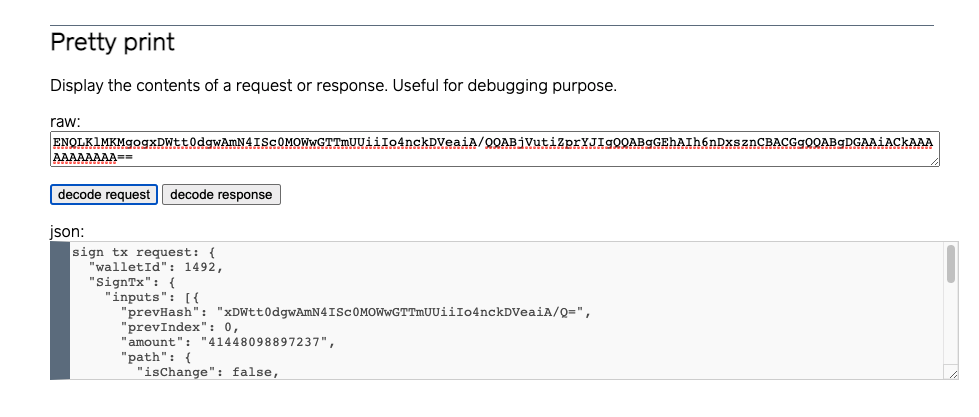

# How to set up and do transaction signing regression (black box) testing for subzero core

*The steps described in this document work for subzero core built as
`TARGET=dev` and `TARGET=nCipher`. In the latter case, your HSM needs to be
configured appropriately so that the dummy master seed and public key
encryption keys (cf.
[core/dev/protection.c](https://github.com/square/subzero/blob/3d96ba033ad4aba2bceef20ec2dac5de4499efa7/core/src/dev/protection.c#L16-L25))
are available in the HSM world. In the rest of the document, we will go over
the steps for `TARGET=dev`, for presentation simplicity.*

## How to run regression tests

- Build subzero code (core, development server and user interface) as
instructed in [subzero documentation](./running_without_hsm.md).

- Start subzero core in a terminal

```bash
# under subzero repository directory root
./core/build/subzero
```

- In another terminal, invoke subzero GUI with option `--signtx-test`

```bash
# under subzero repository directory root
./java/gui/target/gui-1.0.0-SNAPSHOT-shaded.jar --signtx-test
```

## How to create test vectors

An outline of the test vector creation process is as follows.

- Run subzero components locally exactly as described in [subzero
documentation](https://subzero.readthedocs.io/en/master/running_without_hsm/).
Put the follow content in `/data/app/subzero/wallets/subzero-1492.wallet`

```no-highlight
{"currency":"TEST_NET","encrypted_master_seed":{"encrypted_master_seed":"ioBg3WF2BntMnGae6PyWbp1VG4r446PUYVZnt1BzOOVQzHy3XeaqmBXS6tMbE9fsB0sR+Vi9xPgJcayN2uJsJNjEw7S77h9oUUpu0zWrYvl6iRAI4fcezOxbRcc="},"encrypted_pub_keys":[{"encrypted_pub_key":"OytXbV6n2L0l50yLegnaP6ea9jRDfFM0I6J/tJQzvnc2+E2Bleqvh4ZaIoTd7Nm6j9XRag1WYni/K0uoek/0rLnLNGZbrrQLNt5lkfTTcMZ72mEKTRkvRWbJwd8H+p86GLqSqgvofDSE5E5EkgYGhIGSkFy8dLpXK4jpYxAQGrIQ2tNeXKKw2nNPOQ=="},{"encrypted_pub_key":"YxgmbmaiwGON1uHpp6cp7sWxMNNJYbX4tqtEJwbOYqfKWW9k56V/uguQrliIwaG2X7ca6VJ01YQiiMdJciQzb3w182R/HsGiYYdMuHP0PNjVk9ScYby38ofTUfjW8ihUFFjM6FSs7WzZAFCuQ04bNNATuGfdXQK8pgoCHKWKTJ2c3alaZvIauwzkfQ=="},{"encrypted_pub_key":"i36ne27C7pv1psRFttz3oNBVZVwgh/t6sQO3DUDfb6Edw3GvDAea3oPQ3Fm5No3JBWp5/SARPva29lPdi4X4mz+qde2nPYMvIJtW0ndAUGU2kw9dhzVY/FZ8XGnIH33otuKE2i+HxOYwxk6+EqS1WEoWEqRe2LO8h1DTg9GsYzzTyjSj2OKIOGc02A=="},{"encrypted_pub_key":"s/1O2nYnApJd+Mlc10rvGsMghE8AmhfIBXDBW52GBrjML07IVF3pZsgPKt4mLpsf2aUcHYn4P276jrdN1rCCxlkz1haxZawNOD0RUdocg5/h6GjaeOqJVxI6hgD3xqJRT+8e2OjVLwJWSmwbX2ckeKz+u76bFNxiCP2g+UCT94s8amrAeQTLXwF9lg=="}]}
```

- Start subzero core and the development server as normal

  In one terminal

```bash
# under subzero repository directory root
./core/build/subzero
```

  In another terminal

```bash
# under subzero repository directory root
./java/server/target/server-1.0.0-SNAPSHOT.jar server
```

- Run python script `txsign_testcase_expect_scrypt_gen.py` to generate an
[expect script](https://core.tcl-lang.org/expect/index) that will later be
used to generate test vector files.

```bash
# under subzero repository directory root
python3 ./utils/txsign_testcase_expect_script_gen.py > /tmp/subzero_expect.sh
chmod +x /tmp/subzero_expect.sh
```

Under the hood in `txsign_testcase_expect_script_gen.py`:

>   - Generate 255 (17x5x3) test vectors in JSON based on a fixed RNG seed
>   (1492), as well as the number of inputs (MAX 17), the number of outputs
>   (MAX 5) and the size (LARGE, MEDIUM or SMALL) of satoshi amount in a
>   transaction to be signed.
>   - POST the auto-generated JSON payloads in HTTP requests to the local
>   development server's `generate-qr-code/sign-tx-request` API endpoint to
>   retrieve base64-encoded, proto-buffer-formatted sign-transaction requests
>   for the GUI to send to subzero core later.
>   - Construct an expect script using the base64-encoded requests to
>   interact with the GUI automatically, and output the expect script to
>   STDOUT.

- Run the expect script generated in the last step to create a log file
`expect_subzero.log`.

```bash
# under subzero repository directory root
# remove existing log file, if any
rm expect_subzero.log
# invoke expect script, pointing to the GUI jar
/tmp/subzero_expect.sh ./java/gui/target/gui-1.0.0-SNAPSHOT-shaded.jar
# 'expect_subzero.log' should show up below
ls -l expect_subzero.log
```

- Run python script `txsign_testcase_from_expect_log.py` to parse the
expect script log, and generate test vector files in `/tmp/out_dir`

```bash
# under subzero repository directory root
mkdir -p /tmp/out_dir
python3 utils/txsign_testcase_from_expect_log.py -i ./expect_subzero.log -o /tmp/out_dir
# test vector files should now show up
ls -l /tmp/out_dir
```

Here is the content of a sample test vector (`cat /tmp/out_dir/valid-0000`).

```no-highlight
request:ENQLKlMKMgogxDWtt0dgwAmN4ISc0MOWwGTTmUUiiIo4nckDVeaiA/QQABjVutiZprYJIgQQABgGEhAIh6nDxsznCBACGgQQABgDGAAiACkAAAAAAAAAAA==
response:GmwKagpGMEQCIH9/UgdzasFtbHSjV8JXNmUtlqWCb4RbfVehzQlJ1yoNAiBFIvAVeuXCEDCubBygIz1xWrfY0f+o3gV7QAUH44wqkRIggyGhJCTpuwc9nmvbRzbdsOGZ5NDOzJTTjJCDJgn7/os=
```

The request and response in the above example can be displayed in JSON using
the development server's "Pretty print" utility.



## How to add new test vectors for regression test

- How to create new test vectors. There are multiple ways

>  - Rotate the RNG seed in `txsign_testcase_expect_script_gen.py` to
>  generate another set of 255 test vectors
>  - Hack up `txsign_testcase_expect_script_gen.py` to add new test vector
>  generation logic
>  - Hand craft test transactions in JSON, and convert them into test vectors
>  following a procedure similar how `txsign_testcase_expect_script_gen.py`
>  does it, as described in the previous section

- How to make test vectors available for subzero GUI

>  - Copy all test vector files to subzero's source directory
>  `java/gui/src/main/resources/txsign-testvectors/`. Prefix valid (positive)
>  test vector file names with "valid-" (e.g., "valid-0042"), and prefix invalid
>  (negative) test vector file names with "invalid".
>  - Rebuild the GUI jar, and run the regression test
>  - Check the test vectors into the subzero repository

## A few words on the design of this testing approach

We decided to use version controlled test vector files as oppose to
generating them dynamically during the test, for the following reasons:

- Version controlled test vectors more auditable and easily reproducible
- It makes it possible to separate the test vector generation process (a
one-time thing) from the GUI logic
- It makes it possible to re-use existing subzero components (server, core)
for test vector creation, avoiding duplication of functionality
