# Building and Running the code without HSMs

Subzero can be used without HSMs. This is useful for evaluation purpose as well as development. The wallet is however
not encrypted — Subzero's security model assumes you are using a HSM in your production setup.

The instructions in this page work with Mac OS X. Linux users can simply skip irrelevant parts. Windows users are
advised to use a virtualization layer (e.g. Ubuntu inside VirtualBox).

The Core is compiled using _cmake_ and _gcc_. The web server and GUI are built using _gradle_ and run with Java.
Since we don't have a HSM, we'll be using stub classes (included with Subzero) to successfully compile the
code — HSM-specific steps will then be skipped.

## Installing the tools and building the code

This section goes over the minimal set of tools needed to build and run Subzero. If you would like to develop and
contribute to Subzero, we recommend installing [Intellij IDEA](https://www.jetbrains.com/idea/) for the Java piece
and [CLion](https://www.jetbrains.com/clion/) for the C core.

(You can skip some of these steps if you prefer to use Docker instead. The command to build and run the Core is
`cd core; docker build -t subzero . && docker run -t -p 32366:32366 --name subzero subzero`. In the future, we may
provide additional docker files for running the GUI and web server).

    # Open Terminal and install Hermit, see details at https://cashapp.github.io/hermit/
    curl -fsSL https://github.com/cashapp/hermit/releases/download/stable/install.sh | /bin/bash

    # close + re-open the Terminal window for some changes to take effect

    # clone the repo
    git clone --recursive https://github.com/square/subzero.git
    cd subzero

    # Activate the Hermit environment (not necessary if you install the hermit shell hooks)
    . bin/activate-hermit

    # build the Java code
    cd java
    gradle build

    # Install the python packages
    cd ../core
    pip install --upgrade pip
    pip install -r requirements.txt

    # Build the core. We are still in subzero/core.
    mkdir build
    cd build
    TARGET=dev CURRENCY=btc-testnet cmake ../
    make

    # create the wallets directory and create the magic file
    mkdir -p "${HOME}/subzero-wallets/"
    touch "${HOME}/subzero-wallets/.subzero_702e63a9"

## Running the servers and user interface

See also [sample output](core_sample_output.md).

    # start the core (listens on port 32366 by default)
    # when the Core starts, it runs several self checks. Some number of red lines is thus expected
    ./subzero/core/build/subzero

    # in a fresh Terminal tab, start the dev/demo server (listens on port 8080).
    # Remember to activate hermit if you didn't install shell hooks.
    java -jar ./subzero/java/server/build/libs/server-1.0.0-SNAPSHOT.jar server

    # in a fresh Terminal tab, open http://localhost:8080/.
    open http://localhost:8080/

    # start the GUI
    java -jar ./subzero/java/gui/build/libs/gui-1.0.0-SNAPSHOT-shaded.jar --wallet-dir "${HOME}/subzero-wallets"

Your environment should look as following (from top left, going clockwise): the GUI, a web browser, and a Terminal.

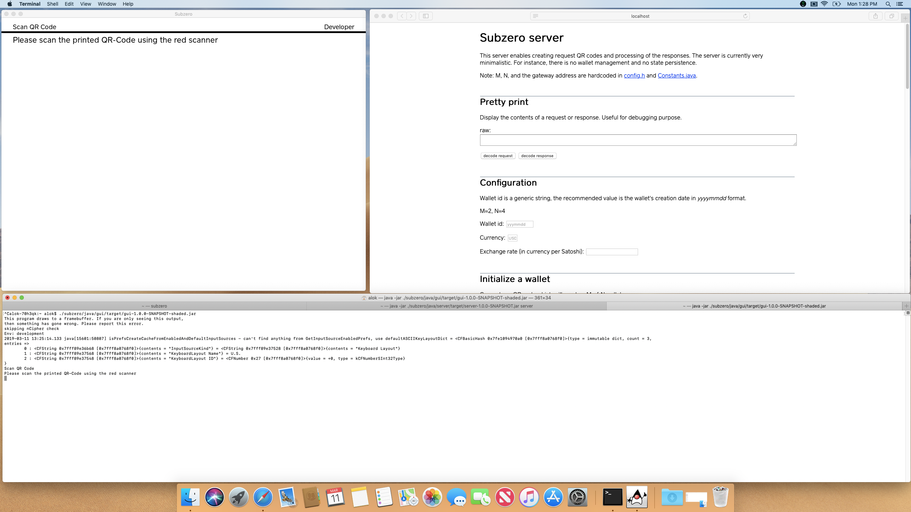

## Creating a wallet and signing your first transaction

By default, Subzero is configured to work with 2-of-4 signatures. Creating a wallet will therefore require 4
initialization and 4 finalization steps. Broadcasting a transaction will require 2 signatures.

### Initialization

On the web browser, click on "generate QR code" under Initialize a wallet. Unless if you set a wallet id, the QR code
should be "EAAaAA==".

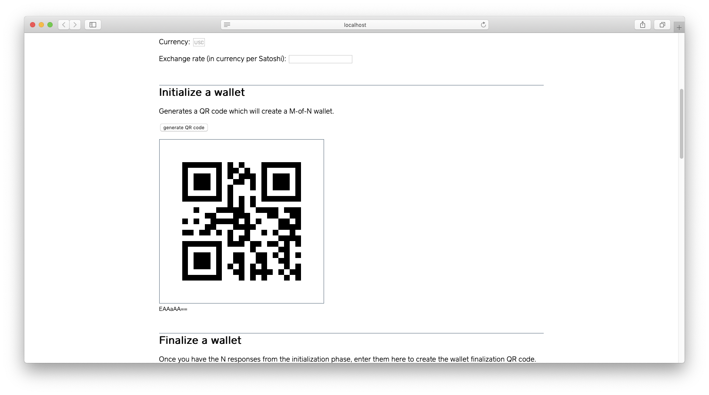

You can paste this code in the GUI, which will change the GUI to the approval step. note: the GUI currently does not
support clipboard operations. You can instead use the Terminal tab to copy-paste data.

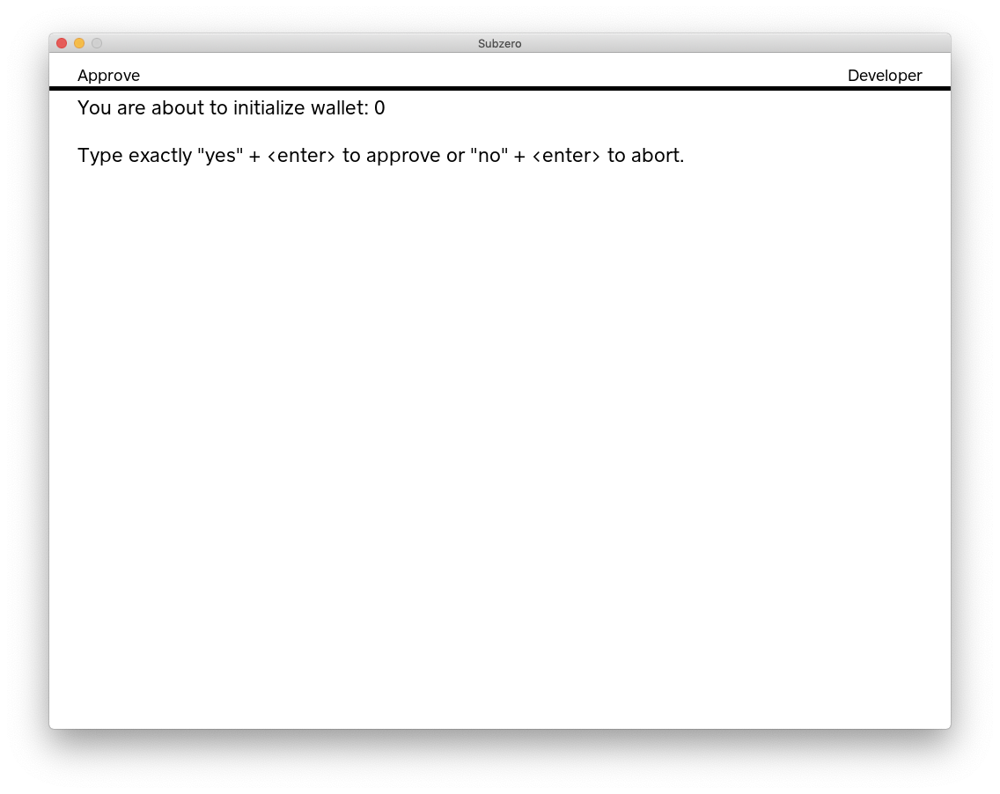

Type "yes" + [enter] to continue. A QR code is displayed, but you can also copy the data from the Terminal. You will
want to save this response in TextEdit. In our case, the response was `CnMKcQpv3trfyO6S55vO5PLtkpjakvPNzdOb+PLe0P3O5sft4tzb55Lp2tLd5N7Fydjs4MPZ8szcn5Lkm53dyc+ewcWSweDF2snP39ub/fny2v/v7ODI8uzA0M7+/8/8meDD0M7znO3vx+ub7+aS3Z3O+sDy`. Since this response contains ciphertext, the data will be different each time.

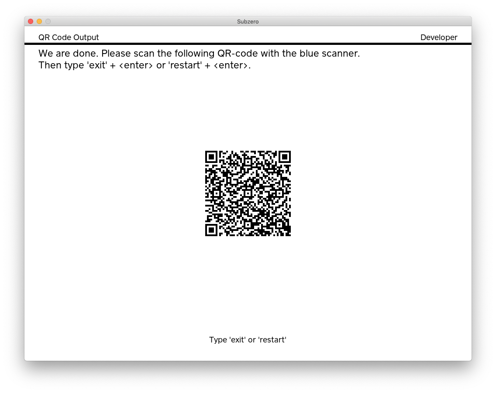

Before you can repeat the wallet initialization process 3 more times, you need to move the wallet file out of the way:

    # In a fresh Terminal tab
    cd "${HOME}/subzero-wallets"
    mkdir initialized
    mv -n subzero-0.wallet initialized/subzero-0.wallet-1

Once you are done initializing the 4 shares, you'll have 4 files in /data/app/subzero/wallets/initialized:

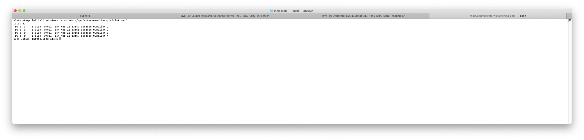

And 4 responses in TextEdit:

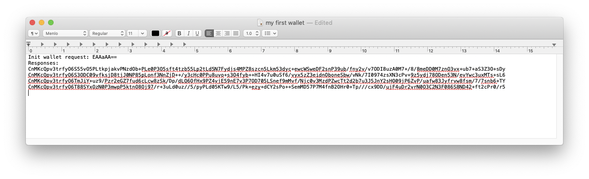

### Finalization

You can now finalize each share. Using the Finalize a wallet section in the web browser, fill out each initialize
response and click on "generate QR code". For reference, here is our data, but yours will differ:

```no-highlight
EAAizAMKcQpv3trfyO6S55vO5PLtkpjakvPNzdOb+PLe0P3O5sft4tzb55Lp2tLd5N7Fydjs4MPZ8szcn5Lkm53dyc+ewcW
SweDF2snP39ub/fny2v/v7ODI8uzA0M7+/8/8meDD0M7znO3vx+ub7+aS3Z3O+sDyCnEKb97a38juktzgwtPb35LIw/LYyd
DT/OaS6J39zZ2Yw/vv8t3B3NDz7vLr6PrNzuH8m/vhyOL+7tLkn+v78sec2d3onZzm6J3km8P7zZP+yNPe+M7Fzd3D7/vc+
cnY+/Dg3p+dzf3r2MHN7sTE7PrC+gpxCm/e2t/I7pOYmJj67P38/OvZ4Znt+53pwtzDzNKT8On90tDo58fH09ni+MTn2cTu
/c/s4PvTktKd5/2Yy9/82NzS/czN09nBxO3Z3Zvu7cnkmdjawc7T2M/pm8/+5p/DzcnJ+u/Dx+yb/v/uydvr5NgKcQpv3tr
fyO6T88SYxOzN0P3mwpP5ktnO8Oj97/r+3uLd0uz//5/pyPLd05KTw9/L5/Pk+ezy+dCY2sPo++SemMD57P7M4fnB2OHr0+
Tp///cx9DD/ujF4uDr2vrN0O3C2N3F086S8ND42+ft2cPr0/r5
```

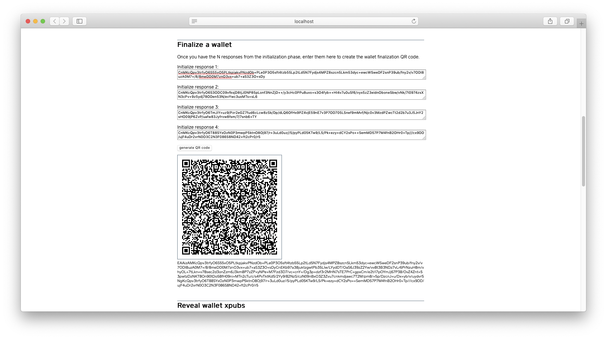

You can now finalize each wallet file. You will have to, one-by-one, copy wallet files from /data/app/subzero/wallets/initialized
to /data/app/subzero/wallets/ and move the result to /data/app/subzero/wallets/finalized/.

    mv -n initialized/subzero-0.wallet-1 subzero-0.wallet

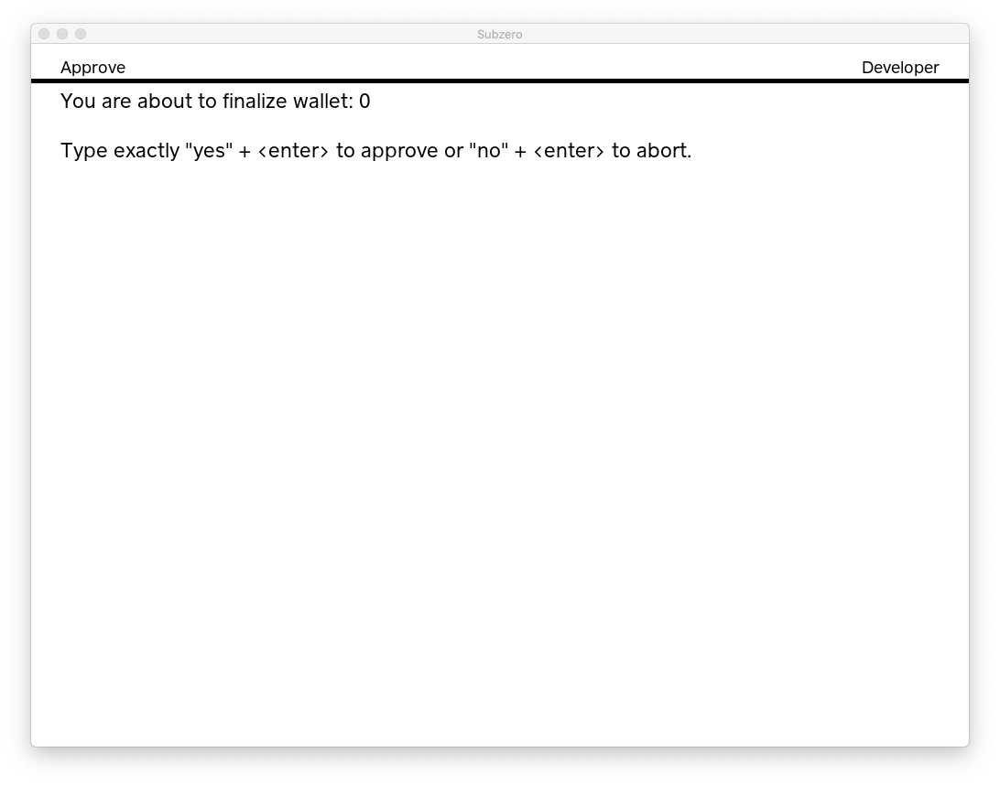

Type "yes" + [enter] to continue. Again, make sure you record each response. Our response was `EnEKb3RwdWJEOE0xZE5YRzgycDhZZ2d5MVJYdHpXZExtR0h2cU04Q3B4d050b2NyRkppc1hmdjU4TjE3d2NlNGtvOGtKb3BjZXVxMVdTWHBVRUZKYlhGanpkVFVlVjNKaXpkWTZHRW1BMUVMOHc3ZFBqWA==`.

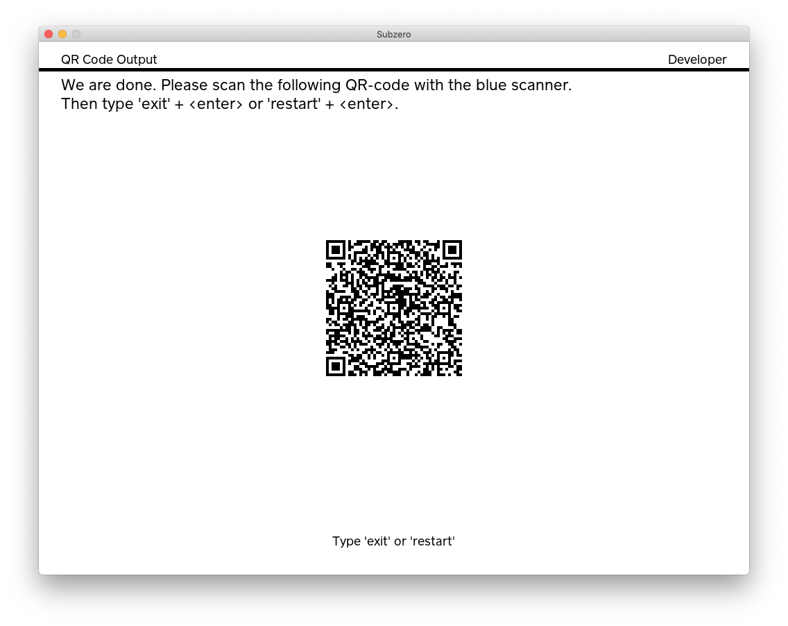

Move the wallet file out of the way and finalize the remaining 3 shares.

    mv -n subzero-0.wallet finalized/subzero-0.wallet-1

Once you are done finalizing the 4 shares, you'll have 4 files in /data/app/subzero/wallets/finalized:

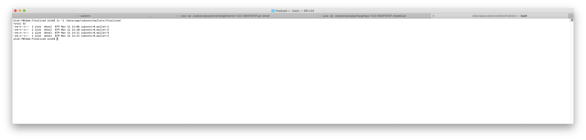

And 4 more responses in TextEdit:

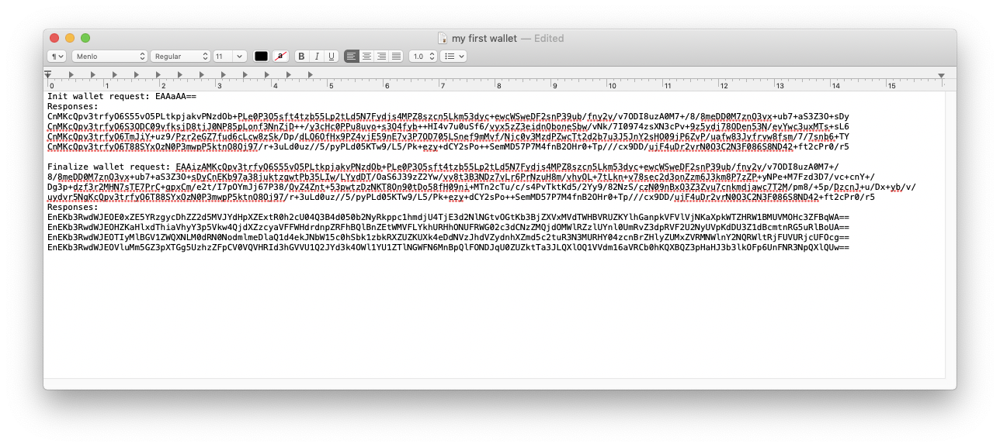

### Reveal wallet xpubs

Using the 4 responses from the finalization step and the web browser, you can get the extended public keys
(`xpub` prefix for mainnet and `tpub` prefix for testnet). These public keys can be used to derive addresses and send
funds to the cold wallet.

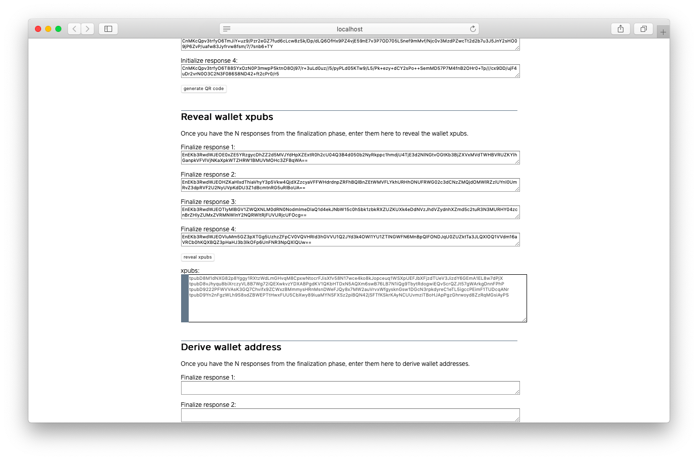

### Derive an address and send funds

Using the same 4 responses from the finalization step and the web browser, you can get addresses. Let's derive the
first non-change address. In our case, we get `2NF3qdAFLNTvC8C7kqbccndZzqU22uFAr8Z`.

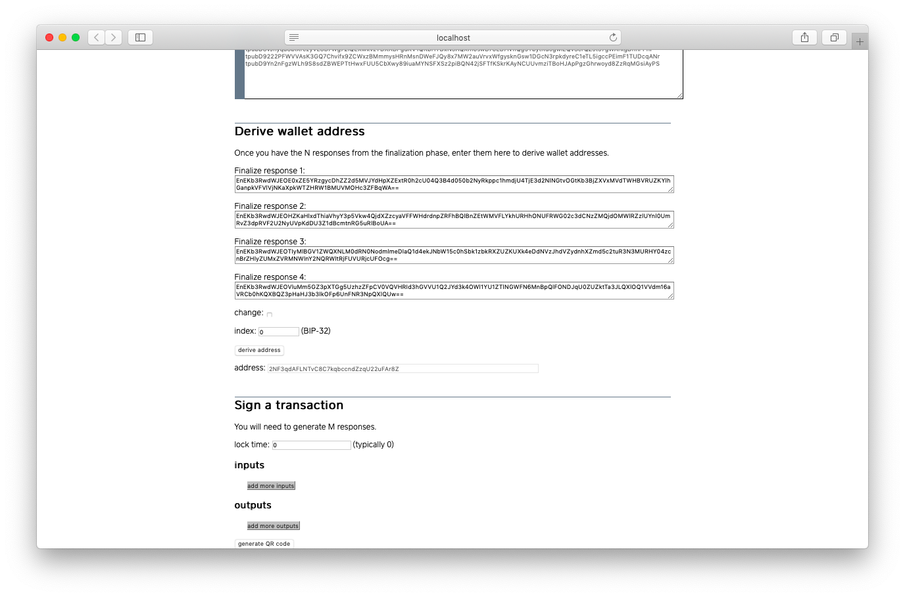

We can send funds to this address and then use our wallet shares to sign a transaction which moves the funds out. For testnet addresses, we can use
a [faucet](https://coinfaucet.eu/en/btc-testnet/), which is a free service available to Bitcoin developers to get testnet coins.

We can then see [our transaction](https://live.blockcypher.com/btc-testnet/tx/1b0d4220b5c857ba5632c8418bf4ab1e0e7913c19cd7b967ee54c66fe566fdcd/) on block explorer.

### Sign a transaction

The server component of Subzero currently does not perform any kind of wallet or UTXO management. We must therefore
provide the inputs and desired outputs. For our first transaction, we'll use the funding transaction as our sole input
and send all the funds (minus the fee) to the gateway.

Using the web browser, we get the following signing request `EAAqTQovCiAbDUIgtchXulYyyEGL9KseDnkTwZzXuWfuVMZv5Wb9zRABGLTdpAQiBBAAGAASDQiU0J4EEAIaBBAAGAAYACIAKQAAAAAAAAAA`.

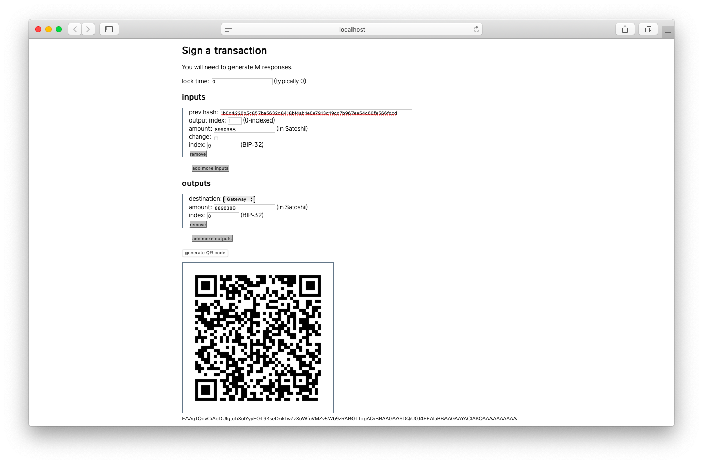

We'll need to use any two wallet shares to sign this transaction.

    mv -n finalized/subzero-0.wallet-1 subzero-0.wallet

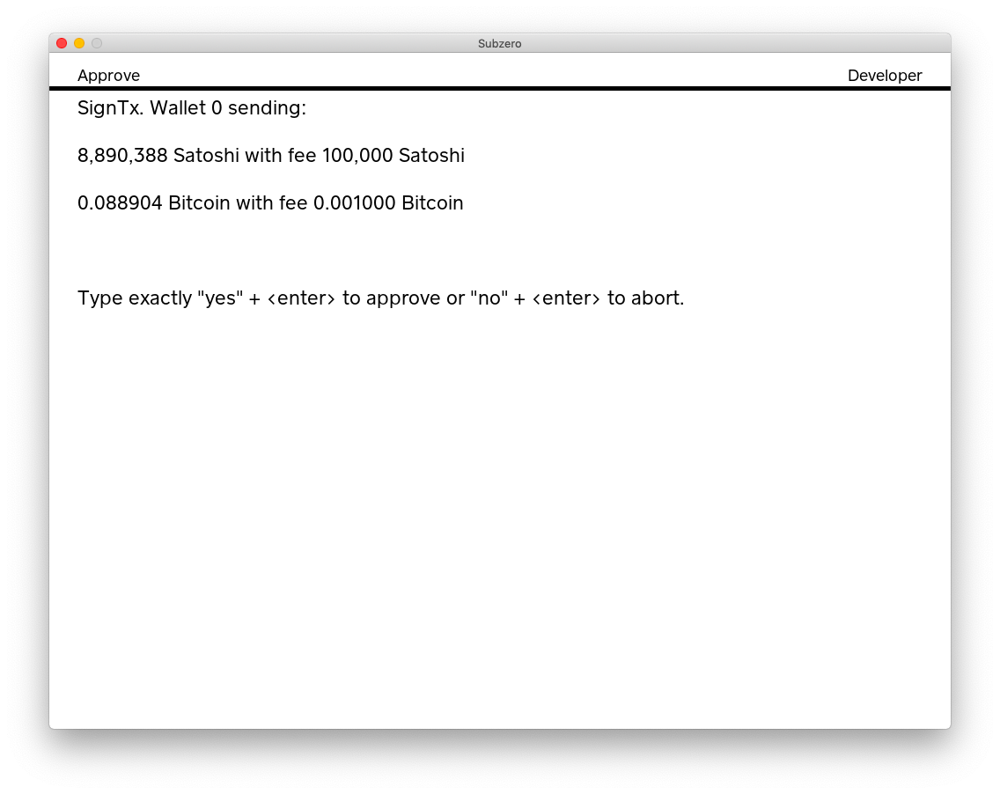

Resulting in a signing response. Repeat the process with another wallet share to get two responses (our threshold).

```no-highlight
GmwKagpGMEQCICeBC0OjJdKkouO4R35z8Us0w2WYzSNKG/BUogzHwFjCAiBQOUX6bM57t+zAajO+sQ341xN6j1f+lh3lHww
uth1SxBIgw0s2r0xGp0FVRtRYTDAUIYKGGUQCdaZHmyoft+5L4/U=
Gm0KawpHMEUCIQDBfIptUIBoz0dP0xvOvzPd4VB0FXLYmsrfk52u8d3U5wIgbiEFEK5EWmunEiC/bh6ftBx9qis4i2w0keR
85/kXJD8SIMNLNq9MRqdBVUbUWEwwFCGChhlEAnWmR5sqH7fuS+P1
```

Use the web browser to merge these signatures into a transaction.

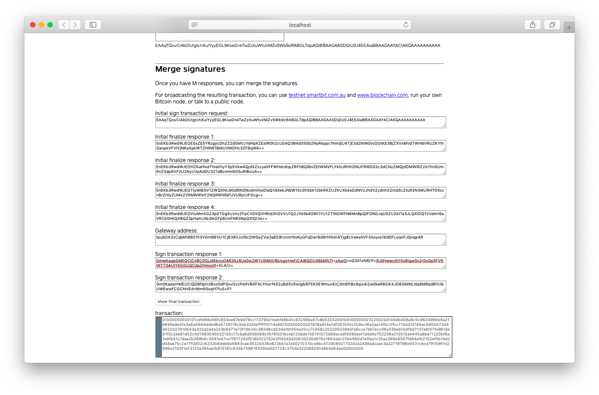

Our final transaction is:

```no-highlight
01000000000101cdfd66e56fc654ee67b9d79cc113790e1eabf48b41c83256ba57c8b520420d1b0100000023220020d
149dbd08a8c5c962496bb5a21b699a9e5fe3a6a4869ddbd6e5728119c5eb325feffffff0114a88700000000001976a9
14e7df301555cf53bcf6a3aa14f0c1ffcc715d312188ac0400473044022027810b43a325d2a4a2e3b8477e73f14b34c
36598cd234a1bf054a20cc7c058c20220503945fa6cce7bb7ecc06a33beb10df8d7137a8f57fe961de51f0c2eb61d52
c401483045022100c17c8a6d508068cf474fd31bcebf33dde150741572d89acadf939daef1ddd4e702206e210510ae4
45a6ba71220bf6e1e9fb41c7daa2b388b6c3491e47ce7f917243f018b522102e2ffd3d3d30630230d87bc1693dac20b
b560d7affea1c35aa368e8587fd84afb2102ef5b14d2d48ae75c2e77f0d02c6232b8ddb6b5683cae36329336e623bb1
a7a4021037dce8bc413908501702d2a2498adcaac3a22719798e947cc4ce7915991e2596e2103f1a53123a385aefb91
5181c634b738618509da507724c375da32206629146b4d54ae00000000
```

We used [https://testnet.smartbit.com.au/txs/pushtx](https://testnet.smartbit.com.au/txs/pushtx) to broadcast this
[transaction](https://live.blockcypher.com/btc-testnet/tx/6d0e73105c63b43a62ee3c5cfedae549b859282cb5d5361aaa5e600417012a76/).
