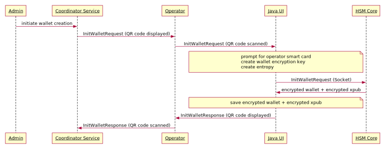

# Wallet initialization

Once the HSMs have been initialized, a wallet initialization ceremony can take place. The wallet initialization is
a two-step process.

## Step one: wallet encryption key creation

In the first step, a wallet encryption key is created (256-bit AES). A wallet is then initialized. For additional
safety purpose, entropy is mixed from the Linux server and the HSM. The resulting xpub is encrypted using the
pubKey encryption key and exported.

<!--
Admin -> Coordinator Service: initiate wallet creation
Coordinator Service -> Operator: InitWalletRequest (QR code displayed)
Operator -> Java UI: InitWalletRequest (QR code scanned)
note over Java UI
prompt for operator smart card
create wallet encryption key
create entropy
end note
Java UI -> HSM Core: InitWalletRequest (Socket)
HSM Core -> Java UI: encrypted wallet + encrypted xpub
note over Java UI
save encrypted wallet + encrypted xpub
end note
Java UI -> Operator: InitWalletResponse (QR code displayed)
Operator -> Coordinator Service: InitWalletResponse (QR code scanned)
-->

_Above process takes place once per location_

By encrypting the xpub, we prevent the operators who are participating in the multi-party ceremony from being able to
build a watch wallet. There's benefit in having a watch wallet which can only exist in the Coordinator service;
including limiting the number of people who gain access to material non-public financial information.

## Step two: exchange of the encrypted xpub

In the second step, each HSM is provided an encrypted xpub from the other locations. This information is stored in
the wallet file and is required for signing transactions. A single xpub is revealed and uploaded to the Coordinator
service.

<!--
Admin -> Coordinator Service: finalize wallet creation
Coordinator Service -> Operator: FinalizeWalletRequest (QR code displayed)
Operator -> Java UI: FinalizeWalletRequest (QR code scanned)
note over Java UI
prompt for operator smart card
load wallet encryption key
end note
Java UI -> HSM Core: FinalizeWalletRequest (Socket)
HSM Core -> Java UI: 1 plaintext xpub
note over Java UI
add encrypted xpubs to wallet
end note
Java UI -> Operator: FinalizeWalletResponse (QR code displayed)
Operator -> Coordinator Service: FinalizeWalletResponse (QR code scanned)
-->

[Finalize wallet](./finalize_wallet.png)
_Above process also takes place once per location_

Once every location has finalized their wallet, the Coordinator service is able to derive addresses and watch
transactions. Funds can be sent to and from the cold wallet.
